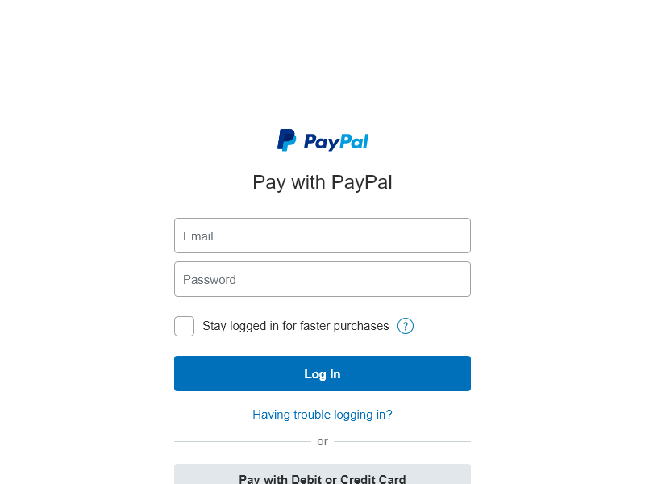
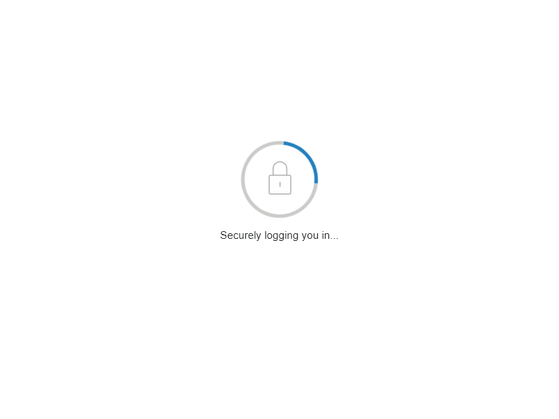
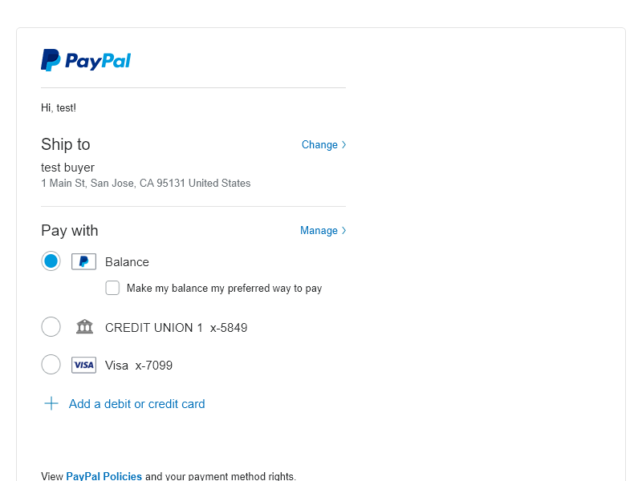

# Demo Paypal auto login with puppeteer

# Instruction

change the email and password(maybe the login url as well) in `index.js`
```
npm install
npm run
```

Then the screenshots like these will be saved

Login page:
<br />


Loading page:
<br />


Payment page:
<br />
